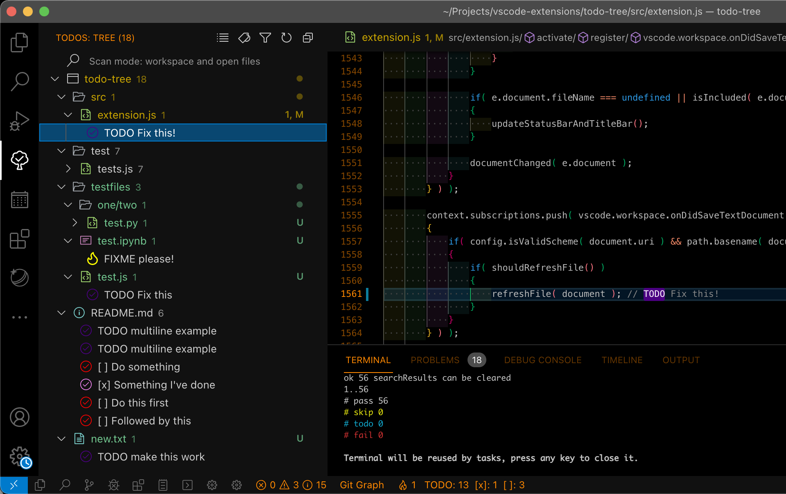

<h1 align="center">
  <br>
  
  <br>
  Todo Tree_Next
  <br>
</h1>

<p align="center">
  <strong>更快、更聪明的 VS Code TODO 树：TypeScript 模块化、Rust 扫描器、Git 感知和 AI Agent 上下文。</strong>
</p>

<p align="center">
  <a href="README.md">English</a> ·
  <a href="README_CN.md">中文</a> ·
  <a href="docs/AGENT_INTERFACE.md">AI Agent 接口</a> ·
  <a href="docs/BENCHMARK.md">性能报告</a>
</p>

<p align="center">
  
  
  
  
  
</p>

<p align="center">
  
</p>

## 为什么选择 Todo Tree_Next

Todo Tree_Next 保留 Todo Tree 熟悉的使用体验，同时把它升级为现代项目维护入口：

- 在大型工作区快速发现 TODO、FIXME、BUG、Markdown 任务和自定义标签。
- 使用 Rust 原生扫描器提升速度，并保留 ripgrep 作为回退方案。
- 识别优先级、负责人、标签、截止日期、Git 状态和分支级 TODO 债务。
- 用仪表盘查看 TODO 分布、趋势和扫描控制。
- 向 AI Code 工具暴露结构化 TODO 上下文，并允许 Agent 把分析结果标注回 VS Code。

## 功能速览

| 能力 | 你会得到什么 |
| --- | --- |
| 快速扫描 | Rust 工作区扫描器、文件级增量刷新、最大文件大小保护 |
| 丰富元数据 | `P0`-`P3`、`TODO!`、`TODO?`、`@负责人`、`due:YYYY-MM-DD`、`#标签` |
| 智能过滤 | `tag:TODO path:src priority:P0 status:open` 等结构化查询 |
| Markdown 任务 | 原生识别 `- [ ]`、`- [x]`、编号任务和普通代码注释 |
| Git 工作流 | 扫描 changed/staged 文件，导出分支 TODO 债务报告 |
| 仪表盘 | 统计、图表、趋势、扫描器控制、过滤控制和 Git 操作 |
| AI Agent 接口 | `getAgentContext`、`annotateAgentFinding`、`agent-context` CLI JSON |
| 原有兼容 | 树视图、高亮、导出、状态栏、分组和跳转能力继续可用 |

## 安装

1. 下载或构建 `.vsix`。
2. 打开 VS Code 扩展面板。
3. 点击 `...` > `Install from VSIX...`。
4. 选择生成的安装包。

## 常用命令

```text
Todo Tree: Refresh
Todo Tree: Open Dashboard
Todo Tree: Scan Changed Files
Todo Tree: Scan Staged Files
Todo Tree: Export TODO Debt Report
Todo Tree: Get Agent TODO Context
Todo Tree: Clear Agent Annotations
```

## 智能过滤

可以混合普通文本和字段查询：

```text
auth
tag:TODO
path:src
file:README.md
text:refactor
priority:P0
status:open
tag:FIXME path:src priority:P1
```

| 字段 | 匹配内容 |
| --- | --- |
| `tag` | `TODO`、`FIXME`、`BUG`、`[ ]`、`[x]`、自定义标签 |
| `path` | 完整文件路径 |
| `file` | 文件名 |
| `text` | TODO 内容 |
| `priority` | `P0`、`P1`、`P2`、`P3`、`none` |
| `status` | Markdown 任务状态：`open` 或 `done` |

## 优先级与元数据

```javascript
// TODO:P0 修复认证漏洞 @alice due:2026-06-01 #security
// FIXME:P1 内存泄漏 @bob #backend
// TODO! 紧急任务      -> P0
// TODO? 需要讨论      -> P2
```

扫描器会把这些提示转换为结构化数据，供树视图、仪表盘、导出、Git 报告和 AI Agent 接口使用。

## 仪表盘与 Git

`Todo Tree: Open Dashboard` 是一个紧凑的控制中心：

- 标签和优先级分布
- TODO 趋势图
- 扫描器引擎切换：`auto`、`rust`、`ripgrep`
- 扫描模式控制
- 智能过滤输入
- changed/staged 扫描快捷操作

Git 相关命令可以帮助你在合并前检查 TODO 债务：

```text
Todo Tree: Scan Changed Files
Todo Tree: Scan Staged Files
Todo Tree: Export TODO Debt Report
```

## AI Agent 接口

Todo Tree_Next 会把 TODO 技术债暴露为机器可读的项目索引。AI Code 工具可以读取排序后的 TODO 上下文，也可以把审查结果、风险提示或建议动作写回 VS Code 临时诊断标注。

VS Code 命令接口：

```javascript
const context = await vscode.commands.executeCommand('todo-tree.getAgentContext');

await vscode.commands.executeCommand('todo-tree.annotateAgentFinding', {
  file: 'src/auth.ts',
  line: 42,
  column: 5,
  severity: 'warning',
  message: 'P0 TODO 涉及认证逻辑，合并前需要审查。'
});

await vscode.commands.executeCommand('todo-tree.clearAgentAnnotations');
```

CLI：

```bash
todo-scanner agent-context --root . --config todo-scanner-config.json
```

Agent 上下文包含文件路径、行列号、标签、优先级、负责人、截止日期、labels、Git 状态、近似历史年龄、上下文代码片段、推荐动作和推荐处理顺序。

完整协议见：[docs/AGENT_INTERFACE.md](docs/AGENT_INTERFACE.md)

## MCP Server

MCP (Model Context Protocol) 服务器作为 `@real-elysia886/todo-tree-mcp` 独立发布。这样 VSIX 可以保持轻量，Claude Code、Codex CLI 等工具也无需依赖 VS Code 安装目录即可使用 TODO 智能能力。

### 配置方法

```json
// .claude/settings.json
{
  "mcpServers": {
    "todo-tree": {
      "command": "npx",
      "args": ["@real-elysia886/todo-tree-mcp", "path/to/workspace"],
      "env": {
        "TODO_TREE_SCANNER_PATH": "path/to/todo-scanner"
      }
    }
  }
}
```

或直接运行：

```bash
TODO_TREE_SCANNER_PATH=path/to/todo-scanner npx @real-elysia886/todo-tree-mcp path/to/workspace
```

### 可用工具

| 工具 | 说明 |
| --- | --- |
| `scan_workspace` | 扫描工作区的 TODO/FIXME/BUG 注释 |
| `scan_file` | 扫描单个文件 |
| `get_agent_context` | 带优先级排名的 Agent 上下文，含 Git 状态、年龄分析和推荐操作 |
| `filter_todos` | 结构化查询过滤（`tag:TODO path:src priority:P0`） |
| `annotate_finding` | 将注解写入 `.todo-tree/annotations.json` |
| `clear_annotations` | 清除注解，可按来源过滤 |
| `get_debt_report` | TODO 债务报告（当前分支 vs 基准分支） |
| `get_branch_todo_risk` | 面向 PR 的 TODO 风险摘要，包含新增债务、过期项和变更文件中的 TODO |

### MCP 资源

| 资源 | URI | 说明 |
| --- | --- | --- |
| Agent 上下文 | `todo-tree://agent-context/{root}` | 实时 TODO 上下文，文件变化时更新 |
| 注解 | `todo-tree://annotations/{root}` | 当前注解 |

### 配置

MCP 服务器按以下优先级读取配置：

1. 环境变量：`TODO_TREE_SCANNER_PATH`、`TODO_TREE_TAGS`、`TODO_TREE_EXCLUDE_GLOBS`
2. 配置文件：工作区根目录下的 `.todo-tree/config.json`
3. 默认值（与 VS Code 扩展一致）

## 架构

```text
MCP 服务器（独立运行，无需 VS Code）
  mcp/src/index.ts      MCP 服务器入口（stdio 传输）
  mcp/src/scanner.ts    Rust CLI 子进程适配器
  mcp/src/config.ts     配置（环境变量/文件/默认值）
  mcp/src/annotations.ts  JSON 文件注解存储
  mcp/src/debtReport.ts Git TODO 债务报告
  mcp/src/filterQuery.ts  结构化过滤解析
  mcp/src/watcher.ts    文件监听 + MCP 资源变更通知

VS Code 插件层
  extension.ts          插件入口和旧逻辑粘合层
  scannerClient.ts      Rust CLI JSON 协议
  agentInterface.ts     AI Agent 上下文和诊断标注
  dashboard.ts          Webview 仪表盘
  tree.ts               树视图数据提供器
  filterQuery.ts        结构化过滤解析
  gitScanner.ts         Git changed/staged 扫描
  debtReport.ts         Git TODO 债务报告
  constants.ts          共享常量（扫描模式、状态栏、按钮）
  globUtils.ts          ripgrep glob 构建工具
  config.ts             配置读取层（带缓存）
  searchResults.ts      Map 索引的搜索结果存储

Rust 扫描器
  main.rs               scan-workspace、scan-file、agent-context、benchmark
  walker.rs             感知 .gitignore 的文件遍历
  matcher.rs            TODO 匹配和元数据提取
  output.rs             JSON 输出结构
```

## 开发与打包

```bash
npm install
npm run scanner:build
npm run webpack
npm test
npm run lint:check
npm run format:check
npm run test:coverage
cargo test --manifest-path scanner/Cargo.toml

# MCP 服务器
cd mcp && npm install && npm run build && npm test
```

打包：

```bash
npm run vscode:prepublish
npx --yes @vscode/vsce package
```

测试覆盖：

| 类型 | 数量 |
| --- | ---: |
| QUnit 测试 | 122 |
| Rust 测试 | 38 |
| MCP 测试 | 27 |
| 总计 | 187 |

## 配置

```json
{
  "todo-tree.scanner.engine": "auto",
  "todo-tree.scanner.path": "",
  "todo-tree.scanner.maxFileSize": 1048576
}
```

| 值 | 行为 |
| --- | --- |
| `auto` | 优先使用 Rust scanner，失败时回退到 ripgrep |
| `rust` | 强制使用 Rust scanner |
| `ripgrep` | 使用原 ripgrep 扫描方式 |

## 更多文档

- [重写说明](docs/REWRITE.md)
- [功能兼容性](docs/COMPATIBILITY.md)
- [AI Agent 接口](docs/AGENT_INTERFACE.md)
- [性能报告](docs/BENCHMARK.md)

## 许可证

MIT。基于 Gruntfuggly 的原版 [Todo Tree](https://github.com/Gruntfuggly/todo-tree) 扩展。
